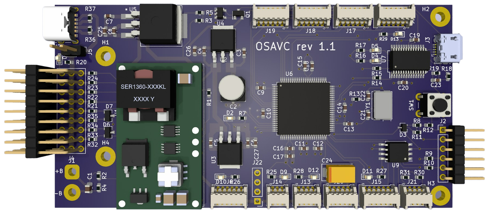
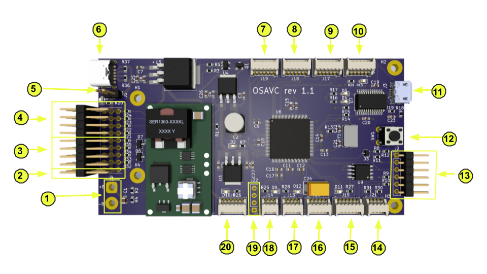

# Hardware

<!--  -->

## Specifications

### Processor

- 32-bit Microchip PIC32MX795F512L
- 512KB Flash
- 128KB RAM
- 80 MHz operating speed

### Power

- Operating power:
  - Voltage regulator: Texas Instruments PTN78020W
  - Input voltage range: 7V-36V
- Micro-USB input (powered by personal computer)
- USB-C input (powered by single board computer)

### Interfaces

- 2x I2C ports
  - Support for 1x LiDAR sensor
- 1x CAN bus interface
- 5x SPI bus ports
  - Support for 1x IMU sensor
- 4x PWM outputs
- 4x GPIO pins
- 1x input capture pin
- 3x UART ports
  - Support for 1x GPS sensor, 1x telemetry, and 1x FrSky RC receiver
- ICSP pins to connect to a PICkit in-circuit debugger

### Dimensions

- Weight: 35g
- Width: 54.61mm
- Height: 10.00mm
- Length: 106.68mm

## Board Architecture

## OSAVC PinOut

| Pin | Signal | Usage |
|-------|------|------|
|1|Power Supply|Use an external connector to power the OSAVC with a DC power supply|
|2|External Input|<ul><li>Ground lane consists of all bottom pins </li><li>Power lane (5V) consists of all middle pins</li><li>Top pin is for input capturing</li></ul>|
|3|GPIO|<ul><li>Ground lane consists of all bottom pins </li><li>Power lane (5V) consists of all middle pins</li><li>Top pins may be used as input or outputs</li></ul>|
|4| PWM|<ul><li>Ground lane consists of all bottom pins </li><li>Power lane (5V) consists of all middle pins</li><li>PWM output consists of all top pins</li></ul>|
|5|J5 Jumper|<ul><li>Placing the shorting block on the J5 pins supplies 5V to the power lane</li><li>If removed, 0V is supplied</li></ul>|
|6|J23 USB-C Connector|Connect the OSAVC to a single board computer to power and communicate with it|
|7|J16 SPI|J16 SPI-1|
|8|J17 SPI|J17 SPI-2|
|9|J18 SPI|J18 SPI-3|
|10|J19 SPI|J19 SPI-4|
|11|J3 micro-USB connector|Connect the OSAVC to a PC to power and communicate with it|
|12|Reset Button|This button can be used to reset the microcontroller, restarting operation from the boot loader.|
|13|J2 ICSP|In circuit serial programming pins to connect to a PICkit in-circuit debugger|
|14|J21 I2C||
|15|J15 GPS||
|16|J20 I2C-LiDAR||
|17|J13 Telemetry||
|18|J14 RC RX||
|19|J22 CAN||
|20|J26 SPI-IMU||

### J16-J19 Pinout

<!-- | Pin | Signal |
|-------|------|
|1|3V|
|2|RE|
|3|SCK|
|4|SDO|
|5|SDI|
|6|Ground| -->

| Pin | 1 | 2| 3 | 4 | 5 | 6 |
| --- | - | -| - | - | - | - |
| Signal | 3V | RE | SCK | SDO | SDI | Ground |

&nbsp;

### J13 Pinout

<!-- | Pin | Signal |
|-------|------|
|1|5V|
|2|TX|
|3|RX|
|4|Ground| -->

| Pin | 1 | 2| 3 | 4 |
| --- | - | -| - | - |
| Signal | 5V | TX | RX | Ground |

### J14 Pinout

<!-- | Pin | Signal |
|-------|------|
|1|Ground|
|2|5V|
|3|Rx| -->

| Pin | 1 | 2| 3 |
| --- | - | -| - |
| Signal | Ground | 5V | RX |

&nbsp;

### J15 Pinout

<!-- | Pin | Signal |
|-------|------|
|1|5V|
|2|RTX|
|3|RX|
|4|SCL|
|5|SDA|
|6|Ground| -->

| Pin | 1 | 2| 3 | 4 | 5 | 6 |
| --- | - | -| - | - | - | - |
| Signal | 5V | RTX | RX | SCL | SDA | Ground |

&nbsp;

### J20 Pinout

<!-- | Pin | Signal |
|-------|------|
|1|5V|
|2|RE|
|3|SCL|
|4|SDA|
|5|Ground| -->

| Pin | 1 | 2| 3 | 4 | 5 |
| --- | - | -| - | - | - |
| Signal | 5V | RE |SCL | SDA | Ground |

&nbsp;

### J21 Pinout

<!-- | Pin | Signal |
|-------|------|
|1|Ground|
|2|3V|
|3|SDA|
|4|SCL| -->

| Pin | 1 | 2| 3 | 4 |
| --- | - | -| - | - |
| Signal | Ground | 3V | SDA | SCL |

&nbsp;

### J22 Pinout

<!-- | Pin | Signal |
|-------|------|
|1|5V|
|2|RX|
|3|TX|
|4|Ground| -->

| Pin | 1 | 2| 3 | 4 |
| --- | - | -| - | - |
| Signal | 5V | RX | TX | Ground |

&nbsp;

### J26 Pinout

<!-- | Pin | Signal |
|-------|------|
|1|RE|
|2|SDI|
|3|SDK|
|4|SDO|
|5|3V|
|6|Ground| -->

| Pin | 1 | 2| 3 | 4 | 5 | 6 |
| --- | - | -| - | - | - | - |
| Signal | RE | SDI | SDK | SDO | 3V | Ground |

&nbsp;

## List of devices (sensors and peripherial) supported by the OSAVC.

|Device|Model|Interface|Note|
|------|------|------|------|
|IMU   |TDK ICM20948|SPI1||
|GPS   |u-blox NEO M8N|UART2||
|Encoder|AS 5047D|SPI2|12 bit, up to four devices|
|Battery voltage|N/A|AN0|Scaled 1:8
|
|GPIO  |N/A|AN1-4/RB2-5| Analog or digital
|
|LiDAR |Garmin V3HP|I2C2||
|ESC   |generic |OC2-5 |Bidirectional/unidirectional|
|Servo |generic |OC2-5 |Shared with ESC|
|RC receiver|FrSky serial|UART5|SBUS protocol
|
|Radio |MRO|UART4|915 MHz, ASCII|
|EEPROM|Microchip 25LC256| I2C1|256 Kbit|
|USB   |FTDI 2232RL|UART1 | Serial-USB converter|
|Programmer|Microchip PICkit3/4ICSP|In-circuit serial programmer|
|User I2C|N/A|I2C1|Connector provided|
|User CAN|N/A|CAN1|For external transceiver|
